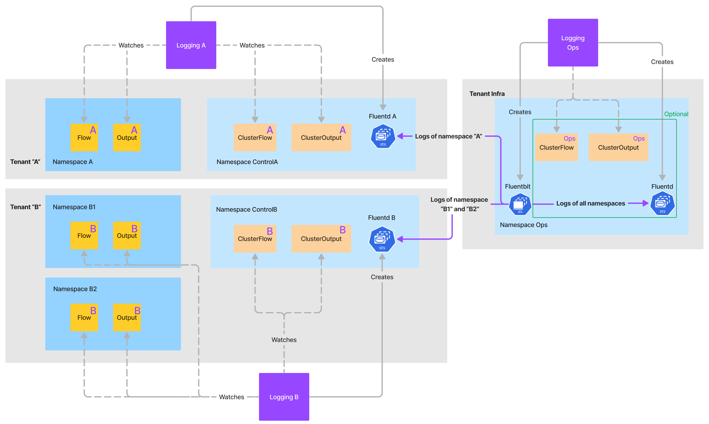

Logging operator supports several multi-tenant scenarios

## Multi-tenancy concepts

> Note: On this page, the _flow_, _clusterflow_, _output_, and _clusteroutput_ terms are used both for Fluentd and syslog-ng related resources for the sake of simplicity.

Logging operator aggregates all container logs, without filtering or routing to Fluentd or syslog-ng. Note the following basic points:

- Only the aggregators can manipulate the logs, using flows and outputs. The FluentBit log collectors running on the nodes cannot.
- `Flow` and `Output` are namespaced resources and can only access the logs of their own namespace, which is enforced in the aggregator.
- `ClusterFlow` resources can access logs from multiple namespaces, as long as the logs are available in the aggregator.
- `ClusterOutput` resources can be referenced from both `ClusterFlow` and from namespaced `Flow` resources.
- The `Logging` resource defines the aggregator and combines all the above resources.

In addition to the previous resources, a resource called `LoggingRoute` (available in Logging operator 4.4 and later) can bridge between logging domains. This resource can be used in the [Hard multi-tenancy scenario](#hard-multi-tenancy-with-a-logging-route).

## Isolation using loggingRef and watchNamespaces

Each resource has a `loggingRef` field, which makes it possible to create multiple logging "domains" with different configuration.

By default, resources with an empty `loggingRef` are processed by all `Logging` resources, except if the `Logging` defines a `watchNamespaces` or `watchNamespaceSelector` field. In that case, the `Flow` and `Output` resources are only combined into a logging configuration if they are all listed as watched namespaces. (`watchNamespaceSelector` is available in Logging operator 4.3 and later.)

`ClusterFlow` and `ClusterOutput` resources (which are actually namespaced resources with multi-namespace capabilities) are by default processed only in the control namespace of the logging resource, which is the namespace where the Fluentd/syslog-ng StatefulSet and the FluentBit DaemonSet are created. There is also an option to process these from all namespaces.

- The collector (FluentBit) collects all logs and sends them to the aggregator. There is no option to filter or route log records on the collector.

    If you have multiple tenants, you have to either:

    - Set up a `logging` resource for routing. This resource has no FluentBit collector defined, and collects and forwards all logs to separate standalone logging aggregators.
    - Set up multiple logging resources that all have collectors, thus processing all log messages on their own.

- WatchNamespaces is a static list. Starting with Logging operator 4.3, you can use `watchNamespaceSelector` is available besides `watchNamespaces` in the logging resource to allow a dynamic, label based selection of namespaces as well.
- Starting with Logging operator 4.2, a logging resource can have multiple FluentbitAgent resources instead of a single one. That way you can perform a rolling upgrade of the collector, or create nodegroup-specific collector configurations.

## Multi-tenancy scenarios

### Soft multi-tenancy with a single logging resource

Users define their own namespaced resources which are merged into a single config and run by a single aggregator in a separate namespace. Multi-namespace resources are typically defined by privileged users like system administrators. Multi-namespace resources are good for:

- Global rules (ClusterFlow + ClusterOutput defined for multiple namespaces).
- Sharing configuration (ClusterOutput is available from namespaced Flows).

Pros:

- This is the default behavior, easy to set up.
- Shared resources.

Cons:

- Noisy/misbehaving neighbors can cause performance issues and configuration errors.
- No real visibility into configuration issues.

### Soft multi-tenancy with watchNamespaces {#soft-watchnamespaces}

In this scenario, every logging resource represents a tenant. A tenant can define its own Flow and Output resources in their designated namespaces. Tenants can also define ClusterFlows and ClusterOutputs, but have to be careful as those can process all logs, even outside the tenant's namespaces.

There are multiple logging resources configured in different control namespaces and the isolation boundary is controlled by the `watchNamespaces` and `watchNamespaceSelector` fields in the logging resource.

Pros:

- Multiple aggregators isolate tenants in terms of resource usage and configuration issues.
- This setup does not need to manage loggingRefs on the resources.

Cons:

- Requires multiple collector daemonsets running and processing the same set of logs on the nodes.
- Using ClusterFlows and ClusterOutputs is discouraged, or need to be tightly controlled.
- Multiple misconfigured logging resources might try to manage the same Flows and Outputs.

### Soft multi-tenancy with logging ref

This solution extends the [Soft multi-tenancy with watchNamespaces](#soft-watchnamespaces) scenario.

There are multiple logging resources configured in different control namespaces. In addition to watchNamespaces, the isolation boundary is also controlled via the `loggingRef` field of the logging resource. This scenario provides tighter control over the relationship of the Flow and Output resources to the Logging resources.

Pros:

- The Flow Output resources cannot be accidentally be managed by multiple Logging resources.

Cons:

- If the users control their own Flow and Output resources, they must make sure the `loggingRef` field is properly set.

### Hard multi-tenancy with a logging route

Experimental feature, available in Logging operator 4.4 and later.

Using the `LoggingRoute` resource, you can now route logs from different namespaces to different aggregators.

For example, an administrator can define a routing rule that allows for sending logs from one centrally managed Fluent Bit agent to multiple different Fluentd or syslog-ng aggregators owned by individual tenants. That way each tenant receives only the logs relevant to them. In addition to that, operations teams still have the ability to receive all logs from the system, for example, to archive them on a cold storage. The following diagram demonstrates this use case given two user-level and one administrator-level tenants:

The `LoggingRoute` resource connects a collector (Fluent Bit) of a logging resource with the aggregators of other logging resources. The collector uses the `watchNamespaces` configuration in the target logging resources to send only the logs relevant to them. This way, target logging resources can effectively work in isolation on their own logs and nothing more.

> Note: This method can be combined with a `loggingRef` as well, similarly to the [Soft multi-tenancy with logging ref](#soft-multi-tenancy-with-logging-ref) scenario.

Pros:

- Log routing happens on the collector level, so there is no possibility for a tenant to accidentally mess with logs outside
of its logging domain.

Cons:

- One collector agent handles multiple output queues and failure scenarios, which FluentBit does not handle well by default.

For details on the `LoggingRoute` resource, see {}.
